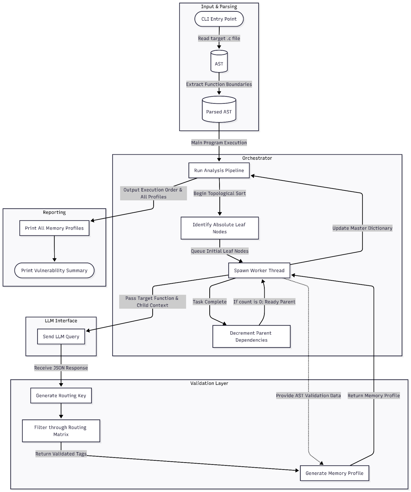

# Leak Logic Mapper

Leak Logic Mapper is an AI-driven, inter-procedural static analysis framework built to hunt down memory leaks in C. Traditional tools struggle with semantic context, and raw LLMs choke on large codebases. Leak Logic Mapper solves both. Instead of analysing an entire program at once, it executes a bottom-up, parallel analysis of the call graph. It evaluates functions in isolation to construct localised Memory Profiles, then passes those semantic profiles upward. By safely abstracting heap logic this way, it seamlessly tracks complex pointer lifecycles across massive execution paths - completely bypassing LLM token limits and context decay.

GIF  *(Placeholder)*

## Academic Context
This framework was researched and developed as part of a final bachelors dissertation at Manchester Metropolitan University. 

For a comprehensive breakdown of the methodology, architecture, and theoretical foundation, the full dissertation report is available in the `docs/` directory:
> **[Read Leak Logic Mapper: Technical Report (PDF)](https://github.com/jj-wallis/Leak-Logic-Mapper/raw/main/docs/Leak_Logic_Mapper_Technical_Report.pdf)**

---

## Architecture



---

## Prerequisites

* **Python 3.8+**
* **Git**
* **Ollama** *(Optional: Only required if running a local language model)*

---

## Installation & Setup

**1. Clone the Repository**

Open your terminal and clone the repository to your local machine:
```bash
git clone https://github.com/jj-wallis/Leak-Logic-Mapper
cd Leak-Logic-Mapper
```

**2. Initialise the Virtual Environment**

It is highly recommended to run this framework within a virtual environment to prevent dependency conflicts. First, create the environment:

On Linux/macOS:
```bash
python3 -m venv .venv
```

On Windows:
```cmd
python -m venv .venv
```

Then, activate it depending on your operating system.

On Linux/macOS:
```bash
source .venv/bin/activate
```

On Windows:
```cmd
.venv\Scripts\activate
```

**3. Install Dependencies**

With the virtual environment active, install the required packages:
```bash
pip install -r requirements.txt
```

---

## Configuration

Leak Logic Mapper requires a `.env` file to manage backend settings and API keys. 

**1. Generate the Configuration File**

Run the following command to duplicate the template file. 

On Linux/macOS:
```bash
cp .env.example .env
```
On Windows:
```cmd
copy .env.example .env
```

**2. Choose Your Inference Engine**

Open the newly created `.env` file. You must configure **ONE** of the following three backends. Ignore the sections for the backends you are not using.

**Option A: OpenAI-Compatible API**

For OpenAI-compatible providers (e.g., OpenAI, Groq, OpenRouter).
1. Set the backend: `LLM_BACKEND=api`
2. Provide your key: `OPENAI_API_KEY=your_api_key_here`
3. Set your target model: `OPENAI_API_MODEL=your_model_here` 
4. Uncomment and set your base URL:
   `OPENAI_BASE_URL=https://api.your-provider.com/v1`

**Option B: Azure OpenAI**

For users routing through Microsoft Azure.
1. Set the backend: `LLM_BACKEND=api`
2. Provide your key: `OPENAI_API_KEY=your_api_key_here`
3. Set your target model: `OPENAI_API_MODEL=your_model_here` *(gpt-4o is suggested)*
4. Uncomment and provide your endpoint: `OPENAI_ENDPOINT=https://your-endpoint.openai.azure.com/`
5. Uncomment and ensure you are using the correct `OPENAI_API_VERSION` for your deployment.

**Option C: Local Hosted Model (Ollama)**

To run the analysis entirely offline using local hardware.
1. Ensure the Ollama background service is running on port 11434.
2. Pull your model: `ollama pull <model_name>` *(Note: The model must enforce JSON formatted outputs).*
3. Set the backend: `LLM_BACKEND=local`
4. Set the model name: `LOCAL_MODEL=<model_name>`

**Advanced System Settings (Optional)**

Depending on your hardware specifications or API rate limits, you can adjust the concurrency limits in the `.env` file:
*   `MAX_WORKERS`: Changes the maximum number of parallel threads. (Reduce this if hitting API rate limits or GPU memory constraints).

---

## Usage

Run the application by pointing it to a specific `.c` file:

```bash
python main.py [OPTIONS] [FILEPATH]
```

Run Leak Logic Mapper with the `-h` option to see a list of available CLI flags.

**Examples using Sample Test Cases**

A suite of sample C files is included in the `tests/sample_test_cases/` directory to verify the tool is operating correctly. To run a baseline test:

```bash
python main.py tests/sample_test_cases/01_basic_allocation_safe.c
```

---

## Evaluation & Benchmarking

To rigorously evaluate Leak Logic Mapper's precision and recall, the framework was tested against a sanitised subset of the **Juliet Test Suite (CWE-401)**, comprising **628 source files** and **2,614 individual functions**. 

*Note: The Juliet Test Suite is a public domain dataset provided by the National Institute of Standards and Technology (NIST) and the NSA Center for Assured Software.*

### Mitigation of LLM Data Leakage
Standard Juliet test cases contain explicit textual hints (e.g., `/* POTENTIAL FLAW */` comments or function names like `_bad()` and `good1()`). To enforce true semantic reasoning rather than text reading comprehension, `scripts/evaluate_juliet.py` passes all target code through a pre-processing sanitisation pipeline that:
* Strips all inline and block comments.
* Standardiaes function identifiers (anonymising synthetic vulnerabilities to `_target` and safe paths to `_variant`).

### Benchmark Results

| Metric | Score / Count |
| :--- | :--- |
| **Evaluated Source Files** | 628 |
| **Total Functions Analysed** | 2,614 |
| **True Positives (TP)** | 626 |
| **True Negatives (TN)** | 1,734 |
| **False Positives (FP)** | 252 |
| **False Negatives (FN)** | 2 |
| **Precision** | **71.30%** |
| **Recall** | **99.68%** |
| **F1 Score** | **0.831** |

**Key Finding:** The **99.68% Recall** rate demonstrates the framework's fail-secure routing logic, successfully catching virtually all explicit memory leak paths across complex call graphs.

### Academic Context & Full Coverage
For a comprehensive breakdown of the evaluation methodology, the theoretical foundation, and the exact data matrices detailing all 628 test cases covered, please refer to section 5.8: Evaluation Metrics in the dissertation report.

---

## License

This project is licensed under the MIT License - see the [LICENSE](LICENSE) file for details.
